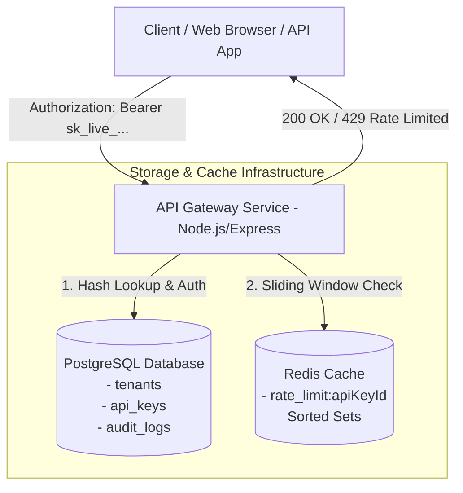

# Multi-Tenant API Key Gateway with Rate Limiting & Rotation

A secure, high-performance, multi-tenant API key management service and gateway built with **Node.js**, **Express**, **PostgreSQL**, and **Redis**. Features cryptographically secure API key hashing (SHA-256), a sliding-window rate limiter implemented from first principles using Redis Sorted Sets, key rotation grace periods, request audit logging, and a modern glassmorphism management console.

---

## 🌟 Key Features

- **Secure API Key Management**:
  - Cryptographically secure API key generation (`sk_live_` + Base64 URL-safe random bytes).
  - SHA-256 key hashing—plaintext keys are never stored in the database.
  - Masked key preview formatting (e.g. `sk_live_...3f9a`).
- **Sliding-Window Rate Limiting (Redis Sorted Sets)**:
  - First-principles sliding window log algorithm using Redis Sorted Sets (`ZREMRANGEBYSCORE`, `ZADD`, `ZCARD`).
  - Transactionally executed using Redis `MULTI`/`EXEC`.
  - Calculates accurate HTTP `429 Too Many Requests` responses with a dynamic `Retry-After` header.
- **Key Rotation with Grace Period**:
  - Allows tenants to rotate compromised or legacy keys seamlessly.
  - 1-minute configurable grace period where both old and newly issued keys remain valid (`expires_at`).
  - Old key automatically expires after grace period without requiring manual cleanup jobs.
- **Audit Logging & Analytics**:
  - Tracks all authenticated requests (200 OK and 429 Rate Limited) in PostgreSQL `audit_logs`.
  - Records tenant ID, API key ID, endpoint path, status code, and millisecond timestamps.
- **Interactive Management Console**:
  - Dark-themed UI console built with HTML5, CSS3, JavaScript, and Chart.js.
  - Real-time key generation, rotation, revocation, audit log table, request volume charts, and interactive API tester harness.
- **Containerized Deployment**:
  - Orchestrated with Docker Compose (`api`, `db`, and `redis` services).
  - Explicit container health checks and automatic database seeding.

---

## 🏗️ Architecture Overview



---

## 🗄️ Database Schema

### `tenants`
| Column | Type | Constraints | Description |
|---|---|---|---|
| `id` | `SERIAL` | `PRIMARY KEY` | Unique tenant ID |
| `name` | `VARCHAR(255)` | `NOT NULL` | Organization / Tenant name |
| `created_at` | `TIMESTAMP` | `DEFAULT CURRENT_TIMESTAMP` | Registration timestamp |

### `api_keys`
| Column | Type | Constraints | Description |
|---|---|---|---|
| `id` | `SERIAL` | `PRIMARY KEY` | Key record ID |
| `tenant_id` | `INTEGER` | `FOREIGN KEY (tenants.id)` | Associated tenant |
| `key_hash` | `VARCHAR(255)` | `NOT NULL, UNIQUE` | SHA-256 hash of API key |
| `key_prefix` | `VARCHAR(10)` | `NOT NULL` | Prefix string (e.g. `sk_live_`) |
| `last_four` | `VARCHAR(4)` | `NOT NULL` | Last 4 characters of key |
| `rate_limit_per_minute` | `INTEGER` | `NOT NULL, DEFAULT 100` | Request limit per 60-second window |
| `is_active` | `BOOLEAN` | `NOT NULL, DEFAULT TRUE` | Key activation status |
| `expires_at` | `TIMESTAMP` | `NULL` | Rotation grace period expiration |
| `created_at` | `TIMESTAMP` | `DEFAULT CURRENT_TIMESTAMP` | Key creation timestamp |

### `audit_logs`
| Column | Type | Constraints | Description |
|---|---|---|---|
| `id` | `SERIAL` | `PRIMARY KEY` | Log record ID |
| `api_key_id` | `INTEGER` | `FOREIGN KEY (api_keys.id)` | Key used for request |
| `endpoint` | `VARCHAR(255)` | `NOT NULL` | Request target path |
| `status_code` | `INTEGER` | `NOT NULL` | Final response HTTP status (200 or 429) |
| `timestamp` | `TIMESTAMP` | `DEFAULT CURRENT_TIMESTAMP` | Log timestamp |

---

## 🚀 Quick Start (Docker Compose)

### Prerequisites
- [Docker Desktop](https://www.docker.com/products/docker-desktop/) (includes Docker Compose)

### 1. Clone & Run Containers
```bash
git clone https://github.com/ofctarun/-Multi-Tenant-API-Key-Gateway.git
cd -Multi-Tenant-API-Key-Gateway

docker compose up -d --build
```

### 2. Verify Health
Check container health status:
```bash
docker compose ps
```
Or query health check endpoint:
```bash
curl http://localhost:3000/health
```

### 3. Open Management Console
Navigate to `http://localhost:3000` in your web browser to access the management UI.

---

## 📡 API Reference

### 1. Issue API Key
Generate a new API key for a tenant. Plaintext key is returned once in response.

- **Endpoint**: `POST /api/tenants/:tenantId/keys`
- **Request Body**:
```json
{
  "rateLimitPerMinute": 100
}
```
- **Response** (`201 Created`):
```json
{
  "apiKey": "sk_live_EXAMPLE_KEY_ABC123456789",
  "keyRecord": {
    "id": 1,
    "lastFour": "56789",
    "rateLimitPerMinute": 100
  }
}
```

---

### 2. List Tenant API Keys
Fetch all keys for a tenant with masked values.

- **Endpoint**: `GET /api/tenants/:tenantId/keys`
- **Response** (`200 OK`):
```json
[
  {
    "id": 1,
    "maskedKey": "sk_live_...6789",
    "createdAt": "2026-08-17T15:30:12.724Z",
    "isActive": true,
    "rateLimitPerMinute": 100,
    "expiresAt": null
  }
]
```

---

### 3. Access Protected Endpoint
Make an authenticated request to a protected gateway route.

- **Endpoint**: `GET /api/protected`
- **Header**: `Authorization: Bearer <plaintext_api_key>`
- **Response Success** (`200 OK`):
```json
{
  "message": "Access granted to protected endpoint",
  "tenantId": 1,
  "keyId": 1,
  "timestamp": "2026-08-17T15:30:12.918Z"
}
```
- **Response Rate Limited** (`429 Too Many Requests`):
```json
{
  "error": "Too Many Requests",
  "message": "Rate limit exceeded. Please try again later.",
  "retryAfter": 60
}
```

---

### 4. Rotate API Key
Issues a new key and sets a 1-minute grace period on the old key.

- **Endpoint**: `POST /api/keys/:keyId/rotate`
- **Response** (`200 OK`):
```json
{
  "newApiKey": "sk_live_EXAMPLE_KEY_XYZ987654321"
}
```

---

### 5. Revoke API Key
Immediately invalidates an API key.

- **Endpoint**: `DELETE /api/keys/:keyId`
- **Response**: `204 No Content`

---

### 6. Query Audit Logs
Fetch paginated audit logs for a tenant console.

- **Endpoint**: `GET /api/tenants/:tenantId/audit-logs?page=1&limit=10`
- **Response** (`200 OK`):
```json
{
  "logs": [
    {
      "id": 1,
      "apiKeyId": 1,
      "maskedKey": "sk_live_...V7Kz",
      "endpoint": "/api/protected",
      "statusCode": 200,
      "timestamp": "2026-08-17T15:30:12.918Z"
    }
  ],
  "pagination": {
    "page": 1,
    "limit": 10,
    "totalLogs": 1,
    "totalPages": 1
  }
}
```

---

## ⚡ How the Redis Sliding Window Rate Limiter Works

The sliding window rate limiter uses Redis Sorted Sets (`ZSET`) keyed by `rate_limit:{apiKeyId}`.

1. **Window Clean Up**: `ZREMRANGEBYSCORE rate_limit:{apiKeyId} 0 {now - 60000}` removes request log entries older than 60 seconds.
2. **Record Request**: `ZADD rate_limit:{apiKeyId} {now} {now}:{uniqueUuid}` records the current request timestamp with a unique payload.
3. **Count Requests**: `ZCARD rate_limit:{apiKeyId}` returns the total requests in the current 60-second window.
4. **Enforce Limit**: If request count exceeds `rate_limit_per_minute`, `Retry-After` header is calculated from the oldest score in the set and returned with status 429.

All steps execute atomically inside a single Redis `MULTI`/`EXEC` block to avoid race conditions.

---

## ⚙️ Development & Testing

Run contract verification tests against running containers:
```bash
node scratch/test_verification.js
```

---

## 📜 License

MIT License.
